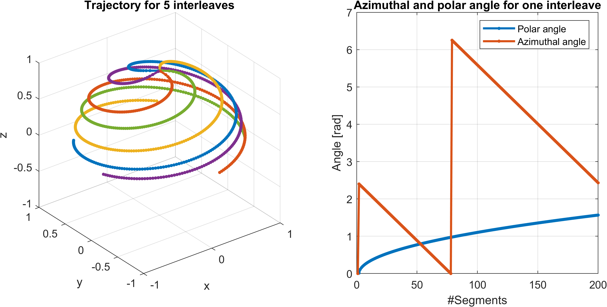
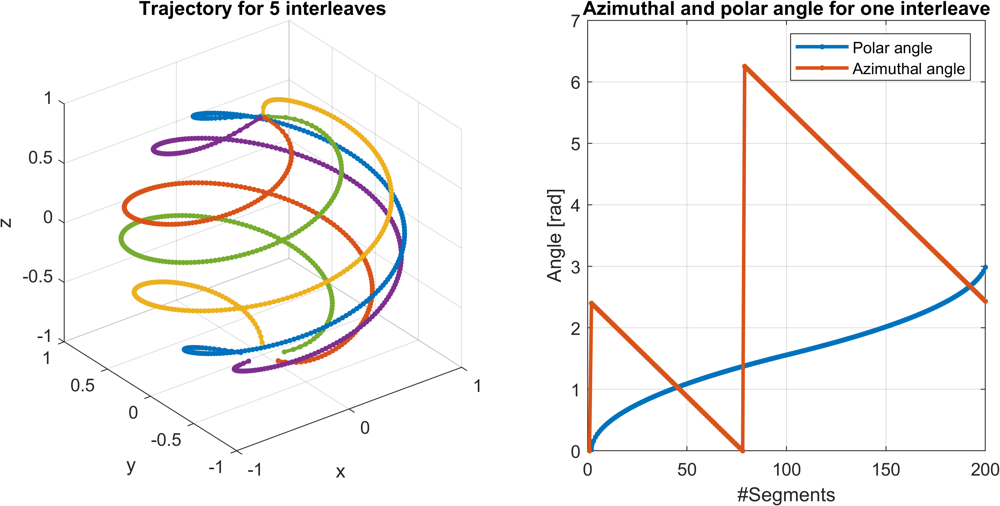
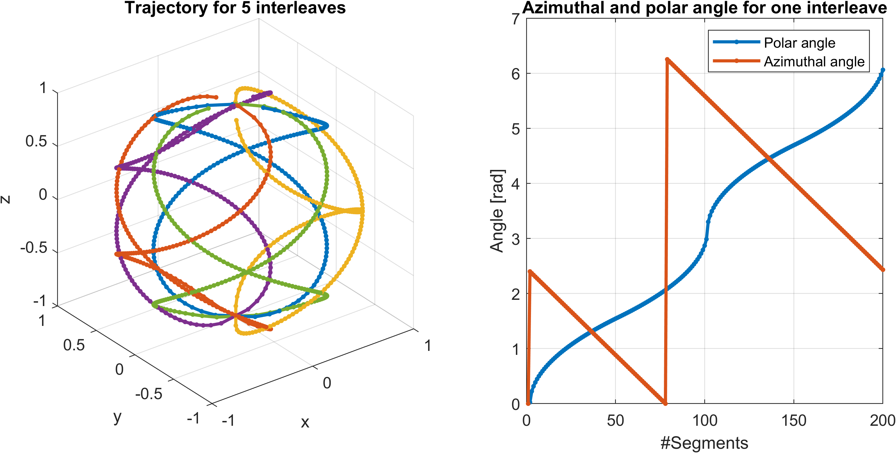

# 3D Radial Phyllotaxis Trajectories

This repository contains implementations of three different 3D radial phyllotaxis trajectories: the **Original Phyllotaxis**, **Pole-to-Pole Phyllotaxis**, and **Continuous Phyllotaxis**. Each method has unique characteristics that impact the sampling of k-space.

## Trajectories

### 1. Original Phyllotaxis
The original phyllotaxis pattern from Piccini et al. ensures uniform coverage of the k-space, distributing points evenly on a spherical surface. 

### 2. Pole-to-Pole Phyllotaxis
In this trajectory, the starting points of the spokes are located on both hemispheres, and the trajectory follows a path from one pole to the other. 

### 3. Continuous Phyllotaxis
The continuous phyllotaxis trajectory builds upon the pole-to-pole approach by adjusting the path so that the angular position increases continuously from one pole to the other before returning to its starting point. This design further minimizes eddy current effects by avoiding jumps at the start of each segment.

## Visualization

The following figures illustrate each of the three methods:

### Original Phyllotaxis

### Pole-to-Pole Phyllotaxis

### Continuous Phyllotaxis

## Code
The repository contains MATLAB code to generate and plot these trajectories. It requires to set the desired number of readout points, interleaves (shots), and segments.

## References
Peper et al., 2024 'Pole-to-pole 3D radial spiral phyllotaxis trajectory designs remove artefacts in imagingimprove image quality and quantitative parametric mapping maps'
